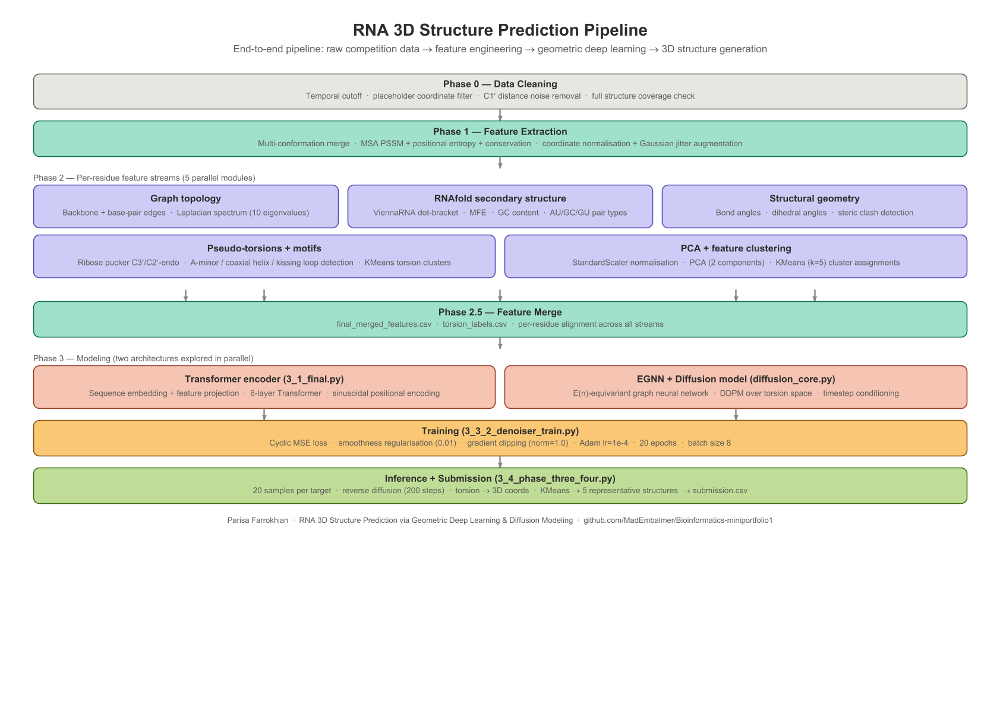
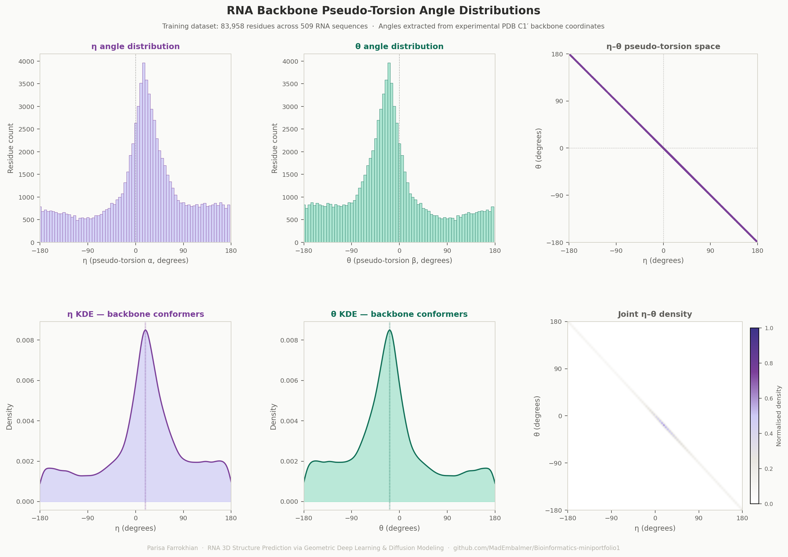

# RNA 3D Structure Prediction via Geometric Deep Learning & Diffusion Modeling

## Overview

This project explores **geometric deep learning for RNA 3D structure generation**, inspired by the 2025 Stanford RNA 3D Folding challenge.

Instead of directly regressing Cartesian coordinates, the pipeline:

1. Predicts **backbone torsion angles** using an equivariant graph neural network (EGNN)
2. Trains a **diffusion-based generative model** over torsion space
3. Reconstructs 3D coordinates via an internal-coordinate decoder
4. Samples multiple conformations per RNA sequence

The focus of this repository is not leaderboard optimization, but **research-driven modeling of RNA geometry under limited biological data conditions**.

---

## Pipeline Overview

The figure below summarizes the complete modeling pipeline, from raw structural data preprocessing to geometric deep learning and diffusion-based structure generation.



---

## Upstream Data & Feature Engineering Pipeline

The preprocessing pipeline (see `preprocessing/` folder) covers 15 modules across 3 phases:

- v1 + v2 data loading with temporal leakage control (CASP-style cutoff)
- Structural RMSD deduplication and Kabsch-based conformation merging
- MSA-derived features: PSSM + positional entropy + conservation (with fallback)
- Full 8-angle backbone torsion extraction directly from PDB via RCSB API (α, β, γ, δ, ε, ζ, χ)
- RNAfold secondary structure integration with BERT-based surrogate model
- Graph spectral features (20 Laplacian eigenvalues, spectral entropy)
- Coordinate augmentation: Gaussian jitter, adversarial noise, random rotation
- Structural geometry: bond angles, dihedrals, curvature, contact maps
- Structural motif detection: A-minor, coaxial helix, kissing loop
- Neural autoencoder + MiniBatchKMeans clustering at residue and RNA level
- Multi-task label extraction: 7 backbone torsions + pseudo-torsions + clash + curvature

---

# Modeling Philosophy

RNA structure prediction is challenging due to:

- Limited experimentally solved RNA structures
- High conformational variability
- Periodic angular representations
- Global topology-based evaluation (e.g., TM-score)
- Small dataset regime compared to proteins

To address this, the modeling pipeline separates:

- **Geometric representation (torsions)**
- **Equivariant learning (EGNN)**
- **Generative diversity (diffusion sampling)**
- **Deterministic geometric reconstruction**

---

# Architecture

## 1. Equivariant Graph Neural Network (EGNN)

Located in: `models/egnn.py`

Key properties:

- Radius graph construction
- Coordinate-aware message passing
- E(n)-equivariant coordinate updates
- Residue-level embeddings
- Torsion prediction head

The EGNN serves as the denoising backbone inside the diffusion model.

---

## 2. Diffusion-Based Torsion Model

Located in: `models/diffusion_model.py`

Features:

- Linear beta schedule (DDPM-style)
- Forward noising (`q_sample`)
- Reverse denoising (`p_sample_ddpm`)
- Timestep conditioning
- Cyclic angular loss
- Smoothness regularization

The model learns to generate plausible torsion configurations via reverse diffusion.

Torsions are predicted in **degrees**, using a cosine-based cyclic loss to respect angular periodicity.

---

## 3. Internal Coordinate Decoder

Located in: `utils/internal_coordinate_decoder.py`

This module:

- Converts torsion angles → Cartesian coordinates
- Uses Rodrigues' rotation formula
- Enforces bond-length continuity
- Produces C1′ backbone traces

---

# Training

Training entry point: `training/train_diffusion.py`
```bash
python training/train_diffusion.py \
  --features features/final_merged_features.csv \
  --torsions features/multitask_labels.csv \
  --outdir checkpoints \
  --epochs 20 \
  --batch-size 8
```

What happens:

- Features are grouped per RNA
- Variable-length sequences are padded
- Torsions are noised at random timesteps
- The EGNN denoiser predicts clean torsions
- Loss = cyclic angle loss + smoothness regularization
- Model checkpoint is saved

---

# Inference & Structure Sampling

Inference entry point: `inference/sample_structures.py`
```bash
python inference/sample_structures.py \
  --features features/final_merged_features.csv \
  --checkpoint checkpoints/diffusion_denoiser.pt \
  --outdir outputs \
  --num-samples 20 \
  --num-final 5 \
  --write-pdb
```

Pipeline:

1. Load trained model
2. Sample torsions via reverse diffusion
3. Decode torsions → 3D coordinates
4. Cluster multiple samples (KMeans)
5. Select representative conformations
6. Optionally export PDB files or Kaggle-style submission.csv

---

# Training Data: Torsion Angle Distributions

The diffusion model was trained to learn the distribution of pseudo-torsion angles (η, θ) extracted from experimental PDB structures. The plots below show the ground truth angular landscape across 83,958 residues from 509 RNA sequences — the target distribution the model was optimised to reproduce.



---

# Experimental Observations

- Diffusion over torsion space enables structural diversity
- Cyclic loss stabilizes angular prediction
- Small RNA datasets limit generative stability
- Torsion MSE does not perfectly align with global topology metrics
- Reverse diffusion quality is sensitive to schedule design

This highlights the gap between local angular objectives and global structural evaluation.

---

# Known Limitations

- EGNN positions were initialised from random noise rather than experimental C1′ coordinates, limiting the geometric inductive bias of the model
- The internal coordinate decoder uses a simplified reconstruction that does not fully respect RNA backbone geometry, causing accumulated error in 3D coordinate reconstruction
- Training was supervised only on pseudo-torsions (η, θ) rather than the full 8 backbone torsions extracted in Phase 1.4, leaving richer supervision signals unused
- Secondary structure features were predicted using RNAfold (single MFE structure), which does not account for pseudoknots or conformational variability
- These limitations explain the gap between local torsion-space training objectives and global topology-based evaluation metrics (TM-score, MCQ) — a challenge documented in the RNA structure prediction literature

---

# Data

The dataset originated from the Stanford RNA 3D Folding Kaggle competition (2025).

Due to Kaggle rules, data is not redistributed here.

To reproduce:

1. Download competition dataset from Kaggle
2. Place relevant CSVs under a local `data/` directory
3. Run preprocessing pipeline in order (see `preprocessing/`)
4. Run training and inference scripts as shown above

---

# Future Directions

- Replace random EGNN position initialisation with experimental C1′ coordinates
- Implement proper Nerf-based internal coordinate reconstruction with correct RNA bond geometry
- Integrate RNA language model embeddings (e.g. RNA-TorsionBERT) as per-residue conditioning features
- Supervise on full 8 backbone torsions from Phase 1.4 instead of pseudo-torsions only
- Von Mises / circular distributions for torsion uncertainty
- Direct TM-score–aware training
- Evaluate generated structures using RNAdvisor 2 (MCQ, TM-score, LCS-TA)

---

# Technical Stack

- PyTorch + PyTorch Geometric
- NumPy / SciPy / scikit-learn
- BioPython (sequence alignment, PDB parsing)
- ViennaRNA (RNAfold secondary structure)
- HuggingFace Transformers (BERT surrogate model)
- Optuna (hyperparameter optimisation)
- joblib (incremental PCA persistence)
- Diffusion modeling / Geometric deep learning

---

# Project Context

This project represents an independent geometric modeling exploration inspired by a Kaggle competition, emphasizing structured model design, mathematical consistency, generative diversity, and research-oriented experimentation.

It demonstrates equivariant neural networks, diffusion generative modeling, angular loss design, internal coordinate geometry, and 3D structure reconstruction pipelines.
